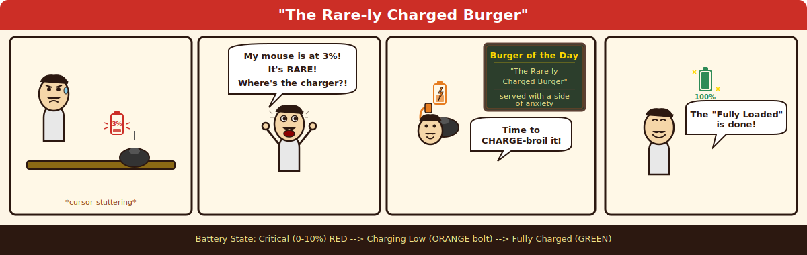
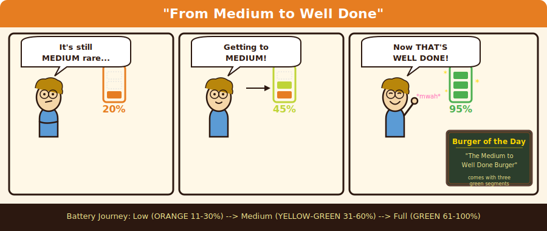
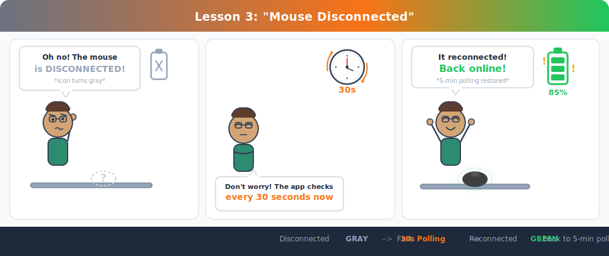
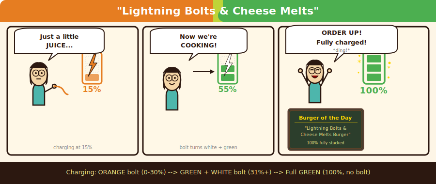

<h1 align="center">
  <br>
  Open Razer macOS
  <br>
</h1>

<p align="center">
  <strong>Community-driven macOS utility for Razer peripherals</strong><br>
  Battery monitoring, RGB control, and HID communication for 250+ devices
</p>

<p align="center">
  <a href="LICENSE"></a>
  
  
  
  
</p>

---

## What It Does

Open Razer macOS gives you native macOS control over your Razer peripherals without Razer Synapse. The **battery menu bar app** lives in your menu bar and keeps you informed about your wireless mouse's charge level with color-coded icons and smart polling. The **RGB control GUI** lets you set lighting effects on mice and keyboards.

---

## Battery Menu Bar App

The star of the show. A lightweight [rumps](https://github.com/jaredks/rumps)-based menu bar app that monitors your wireless Razer mouse battery.

### Install the Standalone App (Recommended)

1. Download **`Razer-Battery-v1.0.0-macOS.zip`** from [Releases](../../releases)
2. Extract and drag **Razer Battery.app** to `/Applications`
3. Right-click the app > **Open** (required first time for unsigned apps)
4. Optional: Add to **System Settings > General > Login Items** for auto-start

### Battery States

The menu bar icon changes color and shape based on your battery level:

| State | Battery | Icon | Color | Description |
|-------|---------|------|-------|-------------|
| **Critical** | 0 -- 10% | Single partial segment | Red | Time to charge immediately |
| **Low** | 11 -- 30% | One full segment | Orange | Charge soon |
| **Medium** | 31 -- 60% | Two segments | Orange + Yellow-Green | Comfortable range |
| **Full** | 61 -- 100% | Three segments | Green | Fully operational |
| **Charging** (low) | Any, charging <=30% | Lightning bolt | Orange bolt | Plugged in, still low |
| **Charging** (high) | Any, charging >30% | Lightning bolt | Green + White bolt | Plugged in, charging well |
| **Disconnected** | -- | Empty outline | Gray | Mouse not found |

### Smart Polling

- **Normal**: Checks battery every 5 minutes (configurable: 1, 5, 10, or 15 min)
- **Disconnected**: Switches to fast 30-second polling until your mouse reconnects
- **Wake**: Waits 2 seconds after sleep/wake for USB re-enumeration, then refreshes
- **Staleness guard**: Forces a re-scan if no successful read in 10+ minutes

### Settings

Configurable from the menu bar dropdown. Settings persist to `~/.config/razer-battery/settings.json`.

| Setting | Default | Options |
|---------|---------|---------|
| Poll interval | 5 min | 1, 5, 10, 15 minutes |
| Low battery threshold | 20% | 10%, 15%, 20% |
| Low battery notification | On | On / Off |
| Display mode | Icon + % | Icon + %, % only, Icon only |
| Launch at login | Off | On / Off |

---

## RGB Control GUI

A PyQt5 interface for setting LED effects on Razer mice and keyboards.

```bash
python3 main.py
```

**Supported effects**: Static color, Breathing, Wave, Reactive

Each effect has configurable parameters (color, speed, direction) through an intuitive tabbed interface.

---

## Quick Start (From Source)

### Prerequisites

> **Important**: Razer's DriverKit extensions claim exclusive HID access. Uninstall them first:
> ```bash
> sudo systemextensionsctl uninstall R2H967U7J8 com.razer.appengine.driver
> sudo systemextensionsctl uninstall R2H967U7J8 com.razer.appengine.virtual.driver
> ```

- macOS (tested on recent versions)
- Python 3.8+
- [Homebrew](https://brew.sh)

### Setup

```bash
# Install system dependency
brew install hidapi

# Clone the repository
git clone https://github.com/ForestApps/OpenMacOSRazer.git
cd OpenMacOSRazer

# Create virtual environment
python3 -m venv venv
source venv/bin/activate

# Install Python dependencies
pip install -r requirements.txt
```

### Run

```bash
# Battery menu bar app
python3 razer_battery_tray.py

# RGB control GUI
python3 main.py
```

> **Note**: Grant **Input Monitoring** permission to your terminal in **System Settings > Privacy & Security** if you encounter HID access errors.

---

## Supported Devices

Over **250 Razer devices** supported via [OpenRazer](https://github.com/openrazer/openrazer) hardware definitions:

| Category | Examples |
|----------|---------|
| **Mice** | DeathAdder (Chroma, Elite, V2-V4), Basilisk (V2, V3, Ultimate), Viper (Ultimate, Mini, 8K), Naga (Trinity, Pro, X), Mamba, Orochi |
| **Keyboards** | BlackWidow (Chroma, Elite, V3, V4), Huntsman (Elite, Mini, V2), Ornata, Cynosa, DeathStalker |
| **Laptops** | Blade Stealth, Blade 14/15/17 (various years) |
| **Headsets** | Kraken 7.1, Kraken Ultimate, Kraken Kitty |
| **Accessories** | Firefly, Goliathus, Mouse Bungees, Headset Stands, Charging Pads |

*While definitions for all devices are included, specific feature support (e.g. unique matrix effects) may vary. Battery monitoring targets wireless mice.*

---

## How It Works

```
                    +------------------+
                    |   Menu Bar App   |
                    |  (rumps / PyQt5) |
                    +--------+---------+
                             |
                    +--------v---------+
                    |   razer_common   |
                    |  Protocol Layer  |
                    +--------+---------+
                             |
                    +--------v---------+
                    |      hidapi      |
                    |  HID over USB    |
                    +--------+---------+
                             |
                    +--------v---------+
                    |   Razer Device   |
                    |   (VID: 0x1532)  |
                    +------------------+
```

**Protocol**: 90-byte HID feature reports with CRC validation. Battery queries use command class `0x07` with per-device transaction IDs. Responses are validated, retried across interfaces on failure, and converted from raw 0-255 values to 0-100% percentages.

**Error Recovery**: Exponential backoff on repeated failures, per-interface retry logic, and interface preference tracking that remembers the last working interface.

---

## How the Battery Indicator Works: A Comic Guide

*Inspired by Bob's Burgers -- because batteries deserve a good pun too.*

<table>
<tr>
<td align="center" width="50%">

**Comic 1: "The Rare-ly Charged Burger"**



*When your battery hits critical (0-10%), it's served RARE*

</td>
<td align="center" width="50%">

**Comic 2: "From Medium to Well Done"**



*Watch the colors go from orange to green as it charges up*

</td>
</tr>
<tr>
<td align="center" width="50%">

**Comic 3: "The Missing Mouse-tery"**



*Where'd the mouse go? Fast polling to the rescue!*

</td>
<td align="center" width="50%">

**Comic 4: "Lightning Bolts & Cheese Melts"**



*The charging bolt journey from orange to green to ORDER UP!*

</td>
</tr>
</table>

---

## Troubleshooting

**Menu bar shows a warning icon instead of battery percentage?**

1. **Remove Razer drivers** -- they claim exclusive HID access:
   ```bash
   sudo systemextensionsctl uninstall R2H967U7J8 com.razer.appengine.driver
   sudo systemextensionsctl uninstall R2H967U7J8 com.razer.appengine.virtual.driver
   ```
2. **Enable Input Monitoring**: System Settings > Privacy & Security > Input Monitoring > enable Razer Battery
3. **Relaunch** the app
4. **Check logs**: `~/Library/Logs/razer-battery-tray.log` for `open failed` HID errors

---

## Roadmap

- Fine-tune matrix effects for advanced keyboards
- Key remapping and macro support
- Auto-sync device definitions with upstream OpenRazer

---

## Contributing

Contributions welcome! Here's how you can help:

- **Test**: Report which devices work and which need tweaks
- **Code**: Submit PRs for new features or bug fixes
- **Reverse engineer**: Help decode protocols for unsupported features

```bash
# Run the test suite
python3 -m pytest tests/ -v
```

1. Fork the repository
2. Create a feature branch
3. Submit a Pull Request

---

## Credits

Built on the shoulders of the **[OpenRazer](https://github.com/openrazer/openrazer)** project -- huge thanks for their extensive reverse engineering and hardware definitions that power device support in this application.

---

## License

[GNU General Public License v3.0](LICENSE)

*This project is not affiliated with Razer Inc.*
